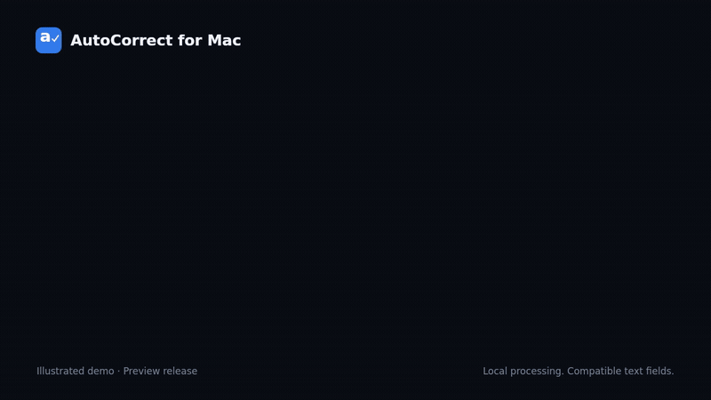

# AutoCorrect

Autocorrect that keeps up with your typing. A small Mac menu bar app that fixes spelling, expands shortcuts, and lets you keep the words you meant to type. Text processing stays on your Mac. Free and open source.

## Download and install

<a href="https://github.com/markoderic/autocorrect/releases/download/v0.3.7/AutoCorrect-0.3.7-universal.zip"></a>

[Download ZIP](https://github.com/markoderic/autocorrect/releases/download/v0.3.7/AutoCorrect-0.3.7-universal.zip) · **macOS 13 or later** · Apple silicon and Intel · [v0.3.7 preview](https://github.com/markoderic/autocorrect/releases/tag/v0.3.7)

**Preview installation notice:** Apple has not notarized this download yet. If you see **“Apple cannot check it for malicious software,”** that is the known first-launch limitation described below. Homebrew installs the same unnotarized build. [Signing status and release process](docs/NOTARIZATION.md).

1. **Download** using the button above, then double-click the ZIP to unzip it.
2. **Drag AutoCorrect.app into Applications**, then open it from there.
3. **Allow Accessibility and Input Monitoring** when prompted. Find both under **System Settings → Privacy & Security**. Quit and reopen AutoCorrect after allowing them.
4. **Start typing.** Look for AutoCorrect in your menu bar to change settings or pause it.

**If macOS blocks the first launch:** this preview is not Apple notarized. After trying to open it, go to **System Settings → Privacy & Security → Open Anyway** for AutoCorrect, if you trust this release. [Apple’s first-open instructions](https://support.apple.com/guide/mac-help/open-a-mac-app-from-an-unknown-developer-mh40616/mac).

### Prefer Homebrew? Two commands

Already have [Homebrew](https://brew.sh)? Open **Terminal** and run these one at a time.

**1. Add AutoCorrect:**

```sh
brew tap markoderic/autocorrect https://github.com/markoderic/autocorrect.git
```

**2. Install it:**

```sh
brew install --cask markoderic/autocorrect/autocorrect
```

Then open **AutoCorrect** from **Applications** and follow steps 3–4 above. The same first-open instructions apply. No Homebrew? Use the download button instead.

<details>
<summary>More about permissions and launch at login</summary>

- **Accessibility** lets AutoCorrect inspect the focused text field and replace the completed word.
- **Input Monitoring** lets it notice when you finish a word while typing in another app.
- AutoCorrect requests launch at login on first launch. macOS may require approval under **System Settings → General → Login Items**. The menu shows its status and lets you enable or disable it.
- Install in Applications before granting permissions. If a rebuilt app stops working, check permissions again: ad-hoc signatures can change between builds. Developers can use a stable local signing identity with the build script.
- The Homebrew package is maintained by this project, outside the official Homebrew cask collection. It installs the same app as the download button.

</details>

**This is an early release.** App compatibility varies; it cannot correct text in every app or field. See [validation and known limits](docs/VALIDATION.md).

## Current source: 0.3.10

The download button and Homebrew install the published **0.3.7 preview**. Versions 0.3.8–0.3.10 below describe source improvements that are not yet published as release downloads. Build from source to use them.

- Immediate first-letter capitalization in verified empty multi-line text fields, with approval mode, continued-typing undo and user overrides preserved.
- Completed product names recover their canonical casing after automatic capitalization; canceled edits retain enough context to retry safely, and custom replacements take priority.
- Conservative damaged-contraction repairs and sentence-start spelling detection, with regression coverage for cancellation, focus changes and retry limits.
- Local automated validation: 233 tests executed, 232 passed, one gated evaluation skipped. Physical-keyboard validation of this batch remains open.

## What changed in 0.3.9

- **Persistent spelling underlines.** Unresolved misspellings stay marked while you keep typing; several words can be marked at once; a mark disappears only when its word is corrected, deleted, ignored or deliberately retyped. Existing text around the caret is checked when a field gains focus, after pasting, scrolling or edits, within documented bounds, and is never rewritten automatically. Contextual grammar doubts (`its`/`it's`) are indicated in the menu but not underlined. Marks follow window moves and resizes, hide while a view scrolls and return afterwards, disappear when you switch apps, and clear predictably when the toggle is turned off. The menu reports how many marks are shown and how many could not be drawn because the editor exposes no trustworthy geometry.
- **Automatic correction unchanged** from the unpublished 0.3.8 work, which is included here: fewer wrong replacements through letter-preserving repairs, joined phrases never replaced by unrelated words, more contractions, verified corrections in rich editors, and the held-out evaluation harness. See the 0.3.8 notes in [docs/releases](docs/releases/).
- **Still unnotarized.** The first-launch caveat above is unchanged.

## What changed in 0.3.8

- **Fewer wrong replacements:** when macOS recommends a different word but its own ranked guesses contain a repair that keeps every letter you typed, that repair wins (`higer → higher`, not `tiger`; `caost → coast`; `considerd → considered`). When several such repairs compete, the word is left alone. On a pinned public misspelling corpus this reduced wrong automatic replacements from 118 to 77 in the held-out half and from 131 to 106 in the development half on one Mac, with a small rise in untouched words. See [evaluation](evaluation/README.md).
- **Joined phrases are never turned into an unrelated word:** `abit`, `aswell`, `upto`, `infront`, `sofar`, `ontop` used to become `bit`, `swell`, `unto`, `infant`, `solar`, `onto`. They are now underlined and the two-word phrase is offered for review. More phrases split automatically: `everytime → every time`, `eachother → each other`, `nevermind → never mind`, `ofcourse → of course`, `infact → in fact`.
- **More contractions:** `hes`, `shes`, `itll`, `youd`, `theyd`, `wouldve`, `couldve`, `shouldve`, `aint`, `yall`, `oclock`, `wheres`, `whens` and others are repaired even when macOS offers no automatic recommendation. Damaged forms of other words are no longer bent into contractions (`heros` stays for review instead of becoming `here's`).
- **Rich editors:** corrections that insert an apostrophe or quote are verified correctly when Notes, TextEdit, Mail or Messages convert it to a curly one, so undo and the respect-my-rewrite protection keep working there. Confirmed with a traced build in TextEdit, Notes and the ChatGPT desktop app; see [validation](docs/VALIDATION.md).
- **Evaluation harness:** `evaluation/` holds a pinned, licensed corpus and a gated test that reports correct repairs, misses, false corrections and abstentions separately, plus a simulator for trying candidate rules against recorded native signals.
- **Still unnotarized.** The first-launch caveat above is unchanged.

[Validation and remaining 1.0 gates](docs/VALIDATION.md) · [Signing details](docs/NOTARIZATION.md).

## See it in action



[Watch the 18-second video](docs/media/autocorrect-demo.mp4) · Illustrated demo, not a screen recording.

## What it does

- English writing rules capitalize standalone `i`, repair `im → I'm` and common missing apostrophes (`doesnt → doesn't`, `dont → don't`), and correct `ti → it`. Damaged short contractions are repaired only with two kinds of evidence at once: the typed letters must be a transposition of the contraction and the system spelling checker must itself name that contraction (`odnt → don't`, `Odnt → Don't`, `cnat → can't`, `odn’t → don’t` keeping the typed apostrophe style); valid words such as `font`, `dent` and `donut` are never touched, and an all-caps form changes only when the next word is also an all-caps dictionary word (`ODNT DO THAT → DON'T DO THAT`; an isolated `ODNT` stays). Ignored words and custom corrections override these defaults. Valid ambiguous words such as `ill`, `well`, and `were` are preserved. Nearby-word rules now automatically fix clearer `its/it’s` and `lets/let’s` contexts; uncertain changes are only indicated in automatic mode.
- Built-in abbreviation expansions: `idk → I don't know`, `omw → On my way`, `brb → Be right back`, `imo → in my opinion`, and `fyi → for your information`. Product/acronym casing includes `iphone → iPhone`, `ui → UI`, `ux → UX`, `api → API`, and `macos → macOS`, and `github → GitHub`. A uniquely matching one-edit typo in a longer known product name can be repaired too (`iphoen → iPhone`, `githbu → GitHub`), after the native dictionary marks it misspelled. Both groups have independent switches in Text Replacements. Ignoring a shortcut disables it individually.
- **Automatic mode:** replaces a misspelled word after a supported word boundary, such as a space. A period or colon waits for the next delimiter to avoid changing a filename or URL before it is complete.
- **Approval mode:** offers a correction through the menu bar so you can decide whether to apply it. Suggestions expire after 30 seconds and are canceled by your next key press.
- Undo the most recent correction with **Control–Option–Command–Z** or the menu bar, even after continuing to type. Undo lasts up to five minutes while the unchanged correction and its context remain within the bounded text window (up to 96 supported characters after it). It restores the original word or abbreviation and preserves following text. It does not replace your editor’s Command–Z.
- When you delete or manually rewrite a recent correction, AutoCorrect respects the changed spelling at that same position in the current text field. It does not silently add it to a global dictionary. Use Ignored Words for a permanent exception.
- A compact, vertically centered letter/checkmark menu bar icon and a native app window with Overview, Writing, Text Replacements, Ignored Words, and Apps. To pause one app, open that app, then choose **AutoCorrect → Pause in [app]**. Choose **Resume in [app]** to turn it back on. The Paused Apps submenu only lists apps installed on your Mac.
- **Settings → Ignored Words:** add names or words that should never be corrected or marked. Remove a word to check it again. Matching ignores capitalization.
- **Settings → Text Replacements:** choose a typed shortcut and its replacement phrase (up to 120 characters), including exact capitalization. Add the same typed word again to update it. Ignored words take precedence over custom corrections.
- **Settings → Writing → Capitalize sentence starts:** enabled by default (an existing on/off choice is kept; the stored setting is unchanged). Two timings: the first letter you type into an **empty multi-line text area** is capitalized immediately, before you type anything else (`h` → `H`, also after leading spaces or an opening quote/bracket), and the word after `. ? !` is capitalized once it is complete (`Done. hello ` → `Done. Hello `, `Really? hello ` → `Really? Hello `). Immediate capitalization needs evidence that the field really is empty: a focused text area whose reported length ends at the caret. Single-line fields (search boxes, address bars, filenames, subject lines), fields with existing text, pasted text, emoji or backtick prefixes, and editors that do not report a length are left alone. Product casing still wins for the completed word (`iphone` → `iPhone`, `github` → `GitHub`, and a typed `iPhone` keeps its own casing), ignored words and exact custom replacements keep priority, undo (⌃⌥⌘Z) restores the lowercase word even after you have finished the sentence, and if you delete the capital and retype the lowercase letter, that occurrence stays lowercase. With **Ask before correcting** on, the first letter is offered as a suggestion instead of being changed. Common abbreviations, initials, decimals, URLs, and ambiguous period endings are skipped. Turn it off independently of spelling correction.
- **Fix missing spaces:** automatically separate clear two-word combinations; turn this off to stop automatic splitting.
- **Show Spelling Underlines:** draws red wavy marks beneath unresolved possible misspellings in the focused field and keeps them there until the word is corrected, deleted, ignored, or deliberately retyped. Marks persist while you type other words; the overlay hides for a moment during keystrokes, scrolling and window moves and is redrawn once the view settles. Existing text is checked in a bounded region around the caret (the editor's visible range when it reports one, at most about 2,000 characters) when a field gains focus, after pasting, scrolling or other edits; existing text is never rewritten automatically. At most 32 marks are kept per field; names, acronyms, code, paths and addresses are never marked, and a capitalized word is checked only where a sentence starts (the first word of the field, or after `. ? !` or a line break) so that automatic capitalization cannot hide a typo; capitalized words elsewhere are treated as names; the word being typed is left alone until it is completed. Marks need the host app to expose on-screen bounds for text ranges: when it does not, the menu says how many possible misspellings were found without drawable geometry instead of guessing positions. The overlay never takes focus, intercepts typing or selects text. AutoCorrect does not change other apps’ native spelling-underline settings.
- English (US) is the default; the language selector is in Settings. Uncertain dictionary suggestions are underlined without approval prompts in automatic mode. Turn on Ask Before Correcting to review suggestions.
- Automatically requests launch at login on first launch; you can turn it off in the menu bar.
- Uses read-only macOS Accessibility to check the field, then native keyboard input to correct it without temporarily selecting the word.
- Runs in the background without a Dock icon. Settings opens only when requested.

This release handles **spelling, text expansion, capitalization, and a narrow set of contextual English suggestions**. It does not provide comprehensive grammar, tone, or rewriting. Apple's dictionaries cover common and uncommon words, but are not an exhaustive list of every English word, name, or technical term. Short missing-letter typos now use native-ranked suggestions too: for example, `ths → this` and `frm → from`. Longer misspellings can use the first native-ranked guess, with edit-distance and ambiguity checks (`capitazed → capitalized` on the development Mac). These are general edit rules, not a fixed list of typos; ambiguous words can still be wrong or left unchanged. If the native top suggestion only separates the exact typed letters with a space or hyphen, the app avoids automatically substituting a different word (`homebrew` no longer automatically becomes `homebred`). A misspelling without a reliable automatic correction is visually flagged when supported; no correction is guaranteed for every word.

## Compatibility and privacy

AutoCorrect relies on each app exposing a usable text field through macOS Accessibility. For Electron apps such as Claude and detected Chromium browsers, it requests accessibility support on activation. Some apps need about two seconds to expose their text tree. Successful requests are made once per process launch; transient failures have bounded retries. Editors that expose attributed text ranges have a bounded range fallback. Rich editors without a character-count attribute can use a bounded text-value fallback when they expose a real caret. Some browser editors, custom controls, terminals, remote desktops, and apps with restricted accessibility will not work. It skips password fields, unsupported fields, and input methods that use composition (IME). Common coding apps, terminals, and password managers are paused by default; use **Paused Apps** to change those exclusions. It checks that the focus, selection, and surrounding text still match before applying a correction. Corrections no longer write selected text through Accessibility, which could leave a word selected and cause the next keystroke to overwrite it. A complete keyboard edit is prepared before anything is deleted; stale edits are canceled, and verification never retries a deletion. Deleted words/phrases and any replayed following text must use ASCII or the explicitly supported single-unit smart quotes and nonbreaking spaces for predictable backspace behavior; the preceding text and replacement may contain Unicode. Fast typing retains up to eight completed-word boundaries and briefly retries stale Accessibility reads. Navigation, focus changes, and editing commands cancel those pending checks. It does not promise support for every app.

Spelling checks run locally through `NSSpellChecker`. AutoCorrect does not send your text to a server or save a typing history. It inspects at most 256 UTF-16 units before the cursor, with a bounded fallback for small fields, and caches up to 256 spelling results in memory. App exclusions, deliberately ignored words, and settings are stored locally. macOS may also apply its own spelling corrections; if you see conflicting behavior, disable one of the correction systems for that app.

The implementation is event-driven rather than continuously polling. It uses native system APIs, with no embedded browser or language model. Exact CPU, memory, and battery use depend on the app and workload; a long-duration power benchmark has not been completed.

## Build and run

Install Xcode Command Line Tools and use a Swift 5.9 or newer toolchain:

```sh
xcode-select --install
git clone https://github.com/markoderic/autocorrect.git
cd autocorrect
swift test --build-system native
./scripts/build.sh
./scripts/install.sh
```

The build script compiles **arm64 and x86_64**, combines them into a universal executable, strips it, signs the app, and writes:

```text
dist/AutoCorrect.app
dist/AutoCorrect-0.3.10-universal.zip
dist/AutoCorrect-0.3.10-universal.zip.sha256
```

It can be called from any working directory. The installer uses `/Applications` when writable, otherwise `~/Applications`. Use `--user` to choose `~/Applications`, `--no-open` to install without launching, and `--replace` to replace an existing installation. Quit AutoCorrect before replacing it; the installer preserves the previous bundle alongside the new one.

To use an existing local signing identity:

```sh
SIGNING_IDENTITY="Apple Development: Your Name (TEAMID)" ./scripts/build.sh
```

A local development signature is not a notarized distribution release. The repository contains no signing credentials.

## Verify

`swift test --build-system native` exercises the pure correction policy. The GitHub Actions workflow runs those tests and builds a universal app archive. Building or passing unit tests does **not** verify macOS permissions, real typing behavior, login behavior, or compatibility with a particular app.

The installed binary also supports `--diagnostics` (permission and login status only) and `--check-spelling` (fixed sample words only). Neither command reads another app's text. Developers can launch a single app instance with `--trace` to print fixed diagnostic phase labels (boundary, snapshot, edit, verification), never typed text or app names. Normal operation does not log these phases.

For a manual check after granting permissions:

1. Open a disposable plain text document in TextEdit. Type `teh `, `ths `, `mispell `, and then continue with `next word`. Confirm the correction and the following text both remain, with no selection left behind. Repeat with punctuation and emoji before the misspelling.
2. Switch on **Ask Before Correcting**. Type a misspelling and a space, then open the menu without typing another key. Confirm the text stays unchanged until you choose **Apply** within 30 seconds.
3. Move the cursor or change focus before approving. Confirm a stale suggestion does not change another field.
4. Exclude TextEdit, then repeat the misspelling and confirm AutoCorrect leaves it alone.
5. Type `idk next`, confirm `I don't know next`, then press Control–Option–Command–Z and confirm `idk next`. Try fast `i ths next`, sentence capitalization on/off, and `lets go` with context checking on, then with approval mode enabled.
6. Try the apps you use every day. Treat fields that do not work as unsupported.
7. Check **Launch at Login** and verify it after your next login.

## Publish a release

`./scripts/release.sh` prepares a notarized archive and checksum locally and requires a Developer ID Application identity plus a notarization keychain profile. See [the signing setup](docs/NOTARIZATION.md). For an explicitly unnotarized preview, use `RELEASE_CHANNEL=preview ./scripts/release.sh`. Before publishing, update the cask version and SHA-256 to match the exact final archive and upload it to the matching GitHub `vVERSION` release. The scripts do not publish anything themselves.

## Uninstall

Turn off launch at login, quit AutoCorrect from the menu bar, and remove the app. For a Homebrew installation, use `brew uninstall --cask markoderic/autocorrect/autocorrect`. Remove its Accessibility and Input Monitoring entries in System Settings if desired. Local preferences are retained unless you remove them separately.

## License

[MIT](LICENSE) · Copyright © 2026 Marko Deric · [Third-party word data](THIRD_PARTY_NOTICES.md)

See the [research and tradeoffs](docs/RESEARCH.md) and [release validation](docs/VALIDATION.md).

## What 1.0 means

The 0.x version marks a preview, not a paid tier or a percentage of completion. Before 1.0, the project needs a larger English regression corpus (including contractions, capitalization, punctuation, short typos, valid words, and user dictionaries), verified real-keyboard behavior in a stated list of native and browser editors, rapid-typing and focus-change tests with no text loss, working approval/undo, measured active/idle resource use, and a dependable signed/notarized install and update process. 0.3.0 adds the native app window, wider regression coverage, expansions, contextual suggestions, and continued-typing undo. Remaining release gates include a documented physical-keyboard app matrix, stress/undo verification across editors, sustained resource measurements, and notarized distribution. The exact desktop chat composer has not yet been independently verified. A version number alone cannot establish reliability, and 1.0 will not promise every English word or every application.
